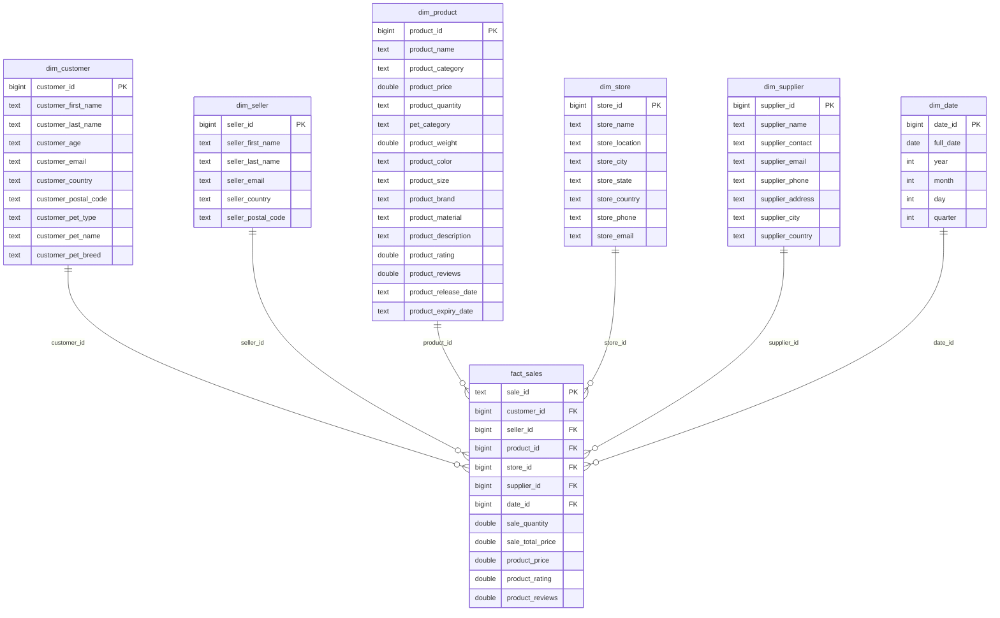

# BigDataSpark — Лабораторная работа №2

## Анализ больших данных — ETL на Apache Spark

## Описание работы

В рамках лабораторной работы реализован ETL-пайплайн на Apache Spark, который выполняет следующие этапы:

1. загрузка исходных CSV-файлов в PostgreSQL в таблицу `public.mock_data`
2. построение модели данных звезда в PostgreSQL с помощью Spark
3. построение 6 аналитических витрин в ClickHouse с помощью Spark

Работа выполнена в рамках обязательной части задания:

- PostgreSQL
- Apache Spark
- ClickHouse

Опциональные реализации для Cassandra, Neo4j, MongoDB и Valkey в данной работе не выполнялись.

## Цель работы

Цель работы — реализовать ETL-процесс с помощью Apache Spark для обработки исходных данных `mock_data(*).csv`, построения модели данных звезда в PostgreSQL и формирования аналитических витрин в ClickHouse.

---

## Структура модели данных в PostgreSQL

### Измерения
- `dim_customer`
- `dim_seller`
- `dim_product`
- `dim_store`
- `dim_supplier`
- `dim_date`

### Факт
- `fact_sales`

### Схема «звезда» (визуализация)

## Что реализовано

### 1. Исходный слой данных в PostgreSQL

Исходные CSV-файлы загружаются в таблицу:

- `public.mock_data`

После загрузки всех 10 файлов таблица содержит:

- `10000` строк

### 2. Модель данных звезда в PostgreSQL

С помощью Spark-джобы `etl_to_star.py` на основе `public.mock_data` строятся таблицы измерений и таблица фактов:

- `public.dim_customer`
- `public.dim_seller`
- `public.dim_product`
- `public.dim_store`
- `public.dim_supplier`
- `public.dim_date`
- `public.fact_sales`

### 3. Витрины в ClickHouse

С помощью Spark-джобы `etl_to_clickhouse.py` на основе модели звезда PostgreSQL создаются и заполняются 6 витрин в ClickHouse:

- `lab.mart_sales_products`
- `lab.mart_sales_customers`
- `lab.mart_sales_time`
- `lab.mart_sales_stores`
- `lab.mart_sales_suppliers`
- `lab.mart_product_quality`

## Используемые технологии

- Docker
- Docker Compose
- PostgreSQL 15
- Apache Spark 3.5.1
- ClickHouse
- Python / PySpark
- DBeaver

Если в проекте дополнительно используется SQL-файл создания витрин ClickHouse, его также следует хранить в репозитории.

## Описание файлов

### `docker-compose.yml`

Файл запуска контейнеров:

- PostgreSQL
- Spark Master
- Spark Worker
- ClickHouse

### `load_mock_data.sql`

SQL-скрипт создания и заполнения таблицы `public.mock_data` из 10 исходных CSV-файлов.

### `app/etl_to_star.py`

Spark-джоба, которая:

- читает `public.mock_data` из PostgreSQL
- строит модель данных звезда в PostgreSQL

### `app/etl_to_clickhouse.py`

Spark-джоба, которая:

- читает таблицы модели звезда из PostgreSQL
- рассчитывает 6 витрин
- загружает витрины в ClickHouse

### `исходные данные/`

Папка с 10 исходными CSV-файлами для лабораторной работы.

## Описание источника данных

Используются 10 файлов:

- `MOCK_DATA (1).csv`
- `MOCK_DATA (2).csv`
- `MOCK_DATA (3).csv`
- `MOCK_DATA (4).csv`
- `MOCK_DATA (5).csv`
- `MOCK_DATA (6).csv`
- `MOCK_DATA (7).csv`
- `MOCK_DATA (8).csv`
- `MOCK_DATA (9).csv`
- `MOCK_DATA.csv`

Каждый файл содержит 1000 строк.

После загрузки всех файлов в PostgreSQL таблица `public.mock_data` содержит:

- `10000` строк

## Архитектура решения

### Этап 1. Загрузка данных в PostgreSQL

Исходные CSV-файлы загружаются в таблицу:

- `public.mock_data`

### Этап 2. Построение модели звезда в PostgreSQL

Spark-джоба `etl_to_star.py` выполняет трансформацию:

- `public.mock_data` -> `dim_*` + `fact_sales`

### Этап 3. Создание витрин в ClickHouse

В ClickHouse создаются таблицы витрин, после чего Spark-джоба `etl_to_clickhouse.py` выполняет загрузку агрегированных данных.

## Структура модели данных в PostgreSQL

### Измерения

- `dim_customer`
- `dim_seller`
- `dim_product`
- `dim_store`
- `dim_supplier`
- `dim_date`

### Факт

- `fact_sales`

## Описание аналитических витрин

### 1. Витрина продаж по продуктам — `mart_sales_products`

Используется для:

- анализа выручки по продуктам
- анализа количества продаж
- анализа рейтингов и отзывов
- определения самых продаваемых товаров

### 2. Витрина продаж по клиентам — `mart_sales_customers`

Используется для:

- анализа сумм покупок по клиентам
- анализа покупательской активности
- анализа среднего чека
- сегментации клиентов по странам

### 3. Витрина продаж по времени — `mart_sales_time`

Используется для:

- анализа месячных трендов продаж
- анализа сезонности
- анализа среднего размера заказа по времени

### 4. Витрина продаж по магазинам — `mart_sales_stores`

Используется для:

- анализа эффективности магазинов
- сравнения выручки между магазинами
- анализа среднего чека по магазинам
- анализа распределения продаж по городам и странам

### 5. Витрина продаж по поставщикам — `mart_sales_suppliers`

Используется для:

- анализа выручки по поставщикам
- анализа средней цены товаров поставщика
- анализа распределения продаж по странам поставщиков

### 6. Витрина качества продукции — `mart_product_quality`

Используется для:

- анализа рейтингов товаров
- анализа отзывов
- сопоставления рейтинга и объёма продаж
- поиска лучших и худших товаров по качественным метрикам

## Требования для запуска

Перед запуском необходимо установить:

- Docker Desktop
- DBeaver или другой SQL-клиент

## Параметры сервисов

### PostgreSQL

- контейнер: `postgres_bd`
- база данных: `lab`
- пользователь: `user`
- пароль: `password`

### Spark

- master-контейнер: `spark_bd`
- worker-контейнер: `spark_worker_bd`

### ClickHouse

- контейнер: `clickhouse_bd`

## Важное замечание по PostgreSQL

Контейнерный PostgreSQL опубликован на внешнем порту:

- `5433`

Это сделано потому, что на хост-машине уже использовался локальный PostgreSQL на порту `5432`.

Внутри Docker-сети Spark обращается к PostgreSQL по адресу:

- `postgres:5432`

## Полная инструкция по воспроизведению лабораторной работы

### Шаг 1. Поднять контейнеры

    docker compose up -d

### Шаг 2. Проверить, что контейнеры запущены

    docker ps

Должны быть запущены контейнеры:

- `postgres_bd`
- `spark_bd`
- `spark_worker_bd`
- `clickhouse_bd`

### Шаг 3. Загрузить исходные CSV в PostgreSQL

Необходимо загрузить все 10 файлов из папки `исходные данные` в таблицу:

- `public.mock_data`

Загрузка выполняется SQL-скриптом:

    docker exec -i postgres_bd psql -U user -d lab < load_mock_data.sql

После загрузки необходимо проверить количество строк:

    docker exec -it postgres_bd psql -U user -d lab -c "select count(*) from public.mock_data;"

Ожидаемый результат:

    10000

## Инструкция по запуску Spark-джоб для проверки лабораторной работы

В проекте используются две Spark-джобы:

1. `app/etl_to_star.py`
2. `app/etl_to_clickhouse.py`

Их необходимо запускать строго в этом порядке.

### Spark-джоба 1 — `app/etl_to_star.py`

#### Назначение

Данная джоба строит модель данных звезда в PostgreSQL.

#### Источник

- `public.mock_data`

#### Результат

Создаются таблицы:

- `public.dim_customer`
- `public.dim_seller`
- `public.dim_product`
- `public.dim_store`
- `public.dim_supplier`
- `public.dim_date`
- `public.fact_sales`

#### Команда запуска

    docker exec -it spark_bd /opt/spark/bin/spark-submit --master spark://spark:7077 --conf spark.jars.ivy=/tmp/ivy --packages org.postgresql:postgresql:42.7.10 /opt/project/app/etl_to_star.py

#### Проверка результата

Проверка списка таблиц:

    docker exec -it postgres_bd psql -U user -d lab -c "\dt public.*"

Проверка количества строк:

    docker exec -it postgres_bd psql -U user -d lab -c "select count(*) from public.dim_customer;"
    docker exec -it postgres_bd psql -U user -d lab -c "select count(*) from public.dim_seller;"
    docker exec -it postgres_bd psql -U user -d lab -c "select count(*) from public.dim_product;"
    docker exec -it postgres_bd psql -U user -d lab -c "select count(*) from public.dim_store;"
    docker exec -it postgres_bd psql -U user -d lab -c "select count(*) from public.dim_supplier;"
    docker exec -it postgres_bd psql -U user -d lab -c "select count(*) from public.dim_date;"
    docker exec -it postgres_bd psql -U user -d lab -c "select count(*) from public.fact_sales;"

### Шаг 4. Создать базу и витрины в ClickHouse

#### Создание базы

    docker exec -it clickhouse_bd clickhouse-client -q "CREATE DATABASE IF NOT EXISTS lab"

#### Создание таблиц витрин

Таблицы витрин можно создать либо через отдельный SQL-файл, либо последовательно командами `CREATE TABLE`.

В результате должны существовать таблицы:

- `lab.mart_sales_products`
- `lab.mart_sales_customers`
- `lab.mart_sales_time`
- `lab.mart_sales_stores`
- `lab.mart_sales_suppliers`
- `lab.mart_product_quality`

Проверка:

    docker exec -it clickhouse_bd clickhouse-client -q "SHOW TABLES FROM lab"

### Шаг 5. Создать пользователя ClickHouse для загрузки из Spark

    docker exec -it clickhouse_bd clickhouse-client -q "CREATE USER IF NOT EXISTS spark_user IDENTIFIED WITH plaintext_password BY 'sparkpass'"
    docker exec -it clickhouse_bd clickhouse-client -q "GRANT ALL ON lab.* TO spark_user"

### Spark-джоба 2 — `app/etl_to_clickhouse.py`

#### Назначение

Данная джоба строит 6 аналитических витрин в ClickHouse на основе модели звезда PostgreSQL.

#### Источник

Таблицы PostgreSQL:

- `public.dim_customer`
- `public.dim_product`
- `public.dim_store`
- `public.dim_supplier`
- `public.dim_date`
- `public.fact_sales`

#### Результат

Заполняются таблицы ClickHouse:

- `lab.mart_sales_products`
- `lab.mart_sales_customers`
- `lab.mart_sales_time`
- `lab.mart_sales_stores`
- `lab.mart_sales_suppliers`
- `lab.mart_product_quality`

#### Команда запуска

    docker exec -it spark_bd /opt/spark/bin/spark-submit --master spark://spark:7077 --conf spark.jars.ivy=/tmp/ivy --packages org.postgresql:postgresql:42.7.10 /opt/project/app/etl_to_clickhouse.py

#### Проверка результата

Проверка количества строк в витринах:

    docker exec -it clickhouse_bd clickhouse-client --user spark_user --password sparkpass -q "SELECT count() FROM lab.mart_sales_products"
    docker exec -it clickhouse_bd clickhouse-client --user spark_user --password sparkpass -q "SELECT count() FROM lab.mart_sales_customers"
    docker exec -it clickhouse_bd clickhouse-client --user spark_user --password sparkpass -q "SELECT count() FROM lab.mart_sales_time"
    docker exec -it clickhouse_bd clickhouse-client --user spark_user --password sparkpass -q "SELECT count() FROM lab.mart_sales_stores"
    docker exec -it clickhouse_bd clickhouse-client --user spark_user --password sparkpass -q "SELECT count() FROM lab.mart_sales_suppliers"
    docker exec -it clickhouse_bd clickhouse-client --user spark_user --password sparkpass -q "SELECT count() FROM lab.mart_product_quality"

## Порядок проверки работы

Для проверки лабораторной работы необходимо выполнить следующие действия:

1. поднять контейнеры через `docker compose up -d`
2. загрузить 10 CSV-файлов в `public.mock_data` с помощью `load_mock_data.sql`
3. убедиться, что `public.mock_data` содержит 10000 строк
4. запустить Spark-джобу `app/etl_to_star.py`
5. убедиться, что таблицы модели звезда созданы в PostgreSQL
6. создать базу и витрины в ClickHouse
7. создать пользователя `spark_user` в ClickHouse
8. запустить Spark-джобу `app/etl_to_clickhouse.py`
9. проверить заполнение всех 6 витрин
10. выполнить контрольные SQL-запросы

## Примеры SQL-запросов для проверки витрин

### 1. Топ-10 продуктов по количеству продаж

    SELECT product_name, total_quantity, total_sales
    FROM lab.mart_sales_products
    ORDER BY total_quantity DESC
    LIMIT 10;

### 2. Топ-10 клиентов по сумме покупок

    SELECT customer_id, customer_first_name, customer_last_name, total_sales
    FROM lab.mart_sales_customers
    ORDER BY total_sales DESC
    LIMIT 10;

### 3. Продажи по времени

    SELECT year, month, total_orders, total_sales, avg_order_value
    FROM lab.mart_sales_time
    ORDER BY year, month;

### 4. Топ-5 магазинов по выручке

    SELECT store_name, store_city, store_country, total_sales
    FROM lab.mart_sales_stores
    ORDER BY total_sales DESC
    LIMIT 5;

### 5. Топ-5 поставщиков по выручке

    SELECT supplier_name, supplier_country, total_sales
    FROM lab.mart_sales_suppliers
    ORDER BY total_sales DESC
    LIMIT 5;

### 6. Продукты с наивысшим рейтингом

    SELECT product_name, avg_rating, total_quantity_sold
    FROM lab.mart_product_quality
    ORDER BY avg_rating DESC
    LIMIT 10;

## Что является результатом работы

В результате выполненной лабораторной работы подготовлен репозиторий, содержащий:

- исходные файлы `mock_data(*).csv`
- `docker-compose.yml` для запуска PostgreSQL, Spark и ClickHouse
- SQL-скрипт загрузки исходных данных в `public.mock_data`
- инструкцию по запуску Spark-джоб для проверки лабораторной работы
- код Spark-трансформации из raw-слоя в модель звезда PostgreSQL
- код Spark-трансформации из модели звезда в витрины ClickHouse

Опциональные реализации для Cassandra, Neo4j, MongoDB и Valkey отсутствуют.

## Итог

В работе реализован полный ETL-пайплайн:

- CSV -> PostgreSQL `public.mock_data`
- PostgreSQL `public.mock_data` -> модель звезда PostgreSQL
- модель звезда PostgreSQL -> 6 витрин ClickHouse

Таким образом выполнена обязательная часть лабораторной работы №2 по дисциплине «Анализ больших данных».
